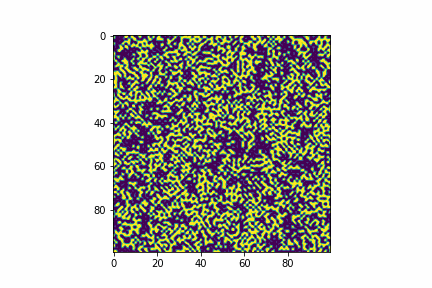

# Game-of-Life
### Animated Game of Life Simulation using Python and Matplotlib.Animation. 
##### There is an opportunity to set up:
 - rules 
 - grid's length
 - input configuretion of cells
 - etc.
Also it stores results in gif format

Here is how it looks:  

